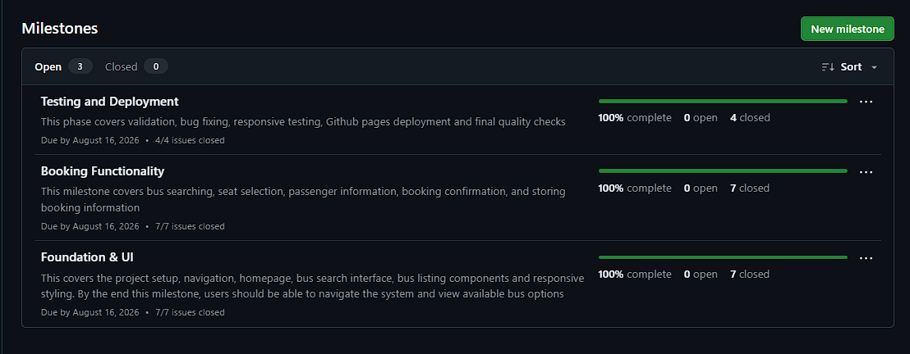
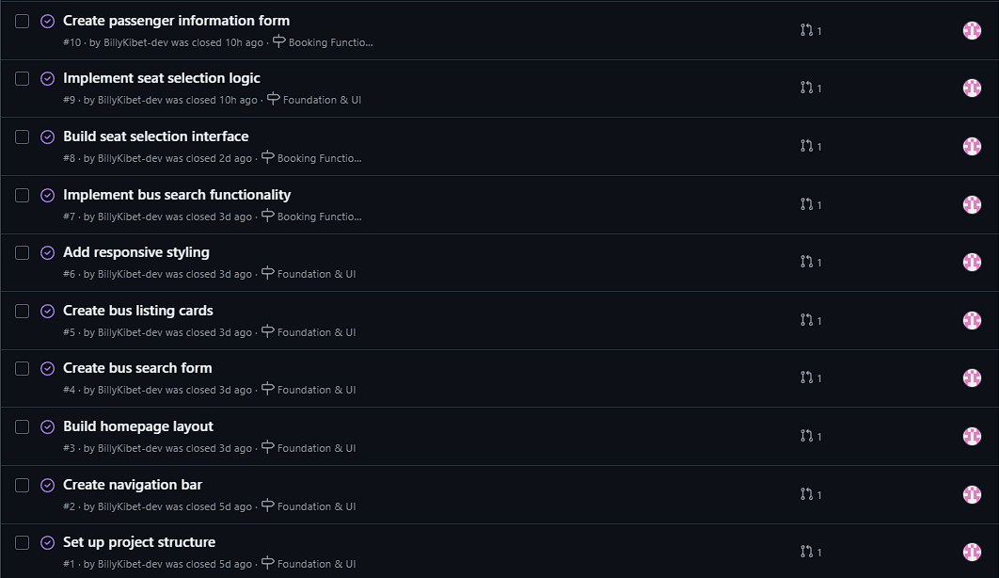
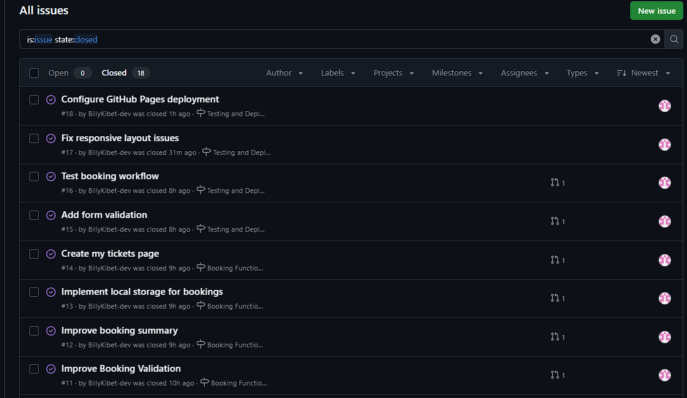
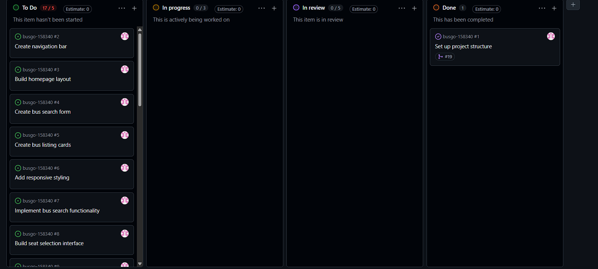
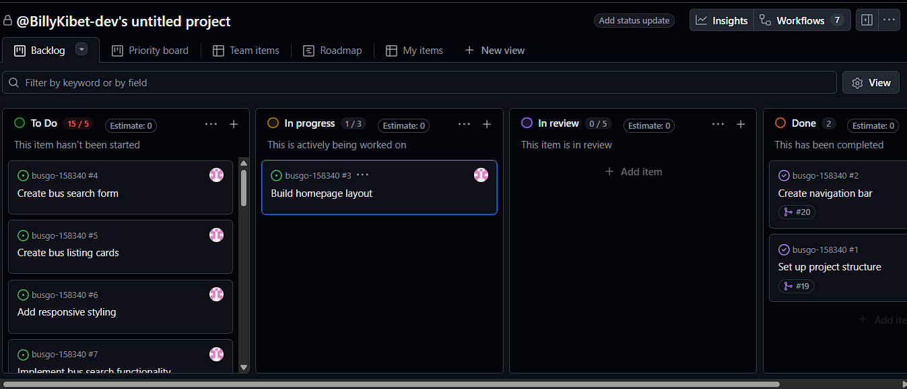
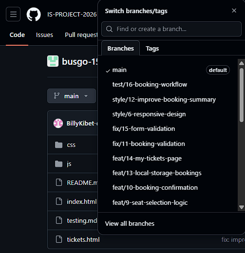
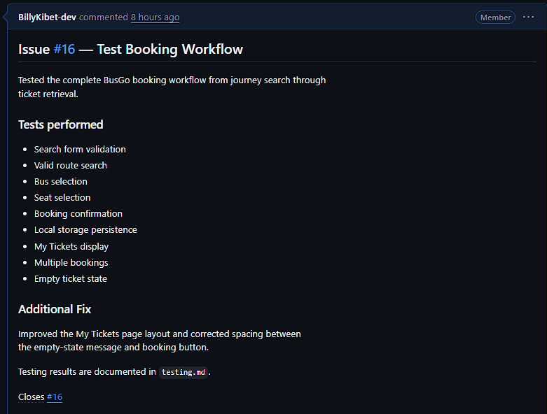

1.Details
Name: Billy Ryan Kibet
Git username: BillyKibet-dev
Email: ryankibet15@gmail.com

2.Project Link:https://is-project-2026.github.io/busgo-158340/

3.Reflection
A.Best Commit
url:https://github.com/IS-PROJECT-2026/busgo-158340/commit/74c2bcbd8d6bbd083fa7765343eec403026f8fc1
I selected this commit because it demonstrates a clear Conventional Commit
format using the `feat` type and a concise subject describing the functionality
that was added. The commit represented a meaningful functional improvement to
the BusGo booking workflow by adding ticket confirmation.

B.Mistake/Struggle
url:https://github.com/IS-PROJECT-2026/busgo-158340/commit/72a41497904b8ab0e128e2791d9086b6afd903ae
I accidentally committed `chore: add booking utility file` directly to the
`main` branch instead of creating an issue-linked feature branch first. I
recognized the workflow mistake and continued subsequent development using
separate branches and pull requests, ensuring that later changes followed the
required branch-isolation workflow.

C.Pull Request I'm Proud Of
url:https://github.com/IS-PROJECT-2026/busgo-158340/pull/38
Before merging, I reviewed the changed files and verified that the pull request
description clearly explained the booking workflow tests and linked the work to
Issue #16. I also reviewed the ticket-page layout changes and confirmed that
the booking workflow, seat selection, localStorage persistence, and My Tickets
functionality were working as expected.

D.One Thing You would Do Differently
If I restarted the project, I would create the issue-linked feature branch
before making any code changes and would avoid committing directly to `main`.
This would make the entire commit history consistent with the required branch
isolation workflow from the beginning.
url:https://github.com/IS-PROJECT-2026/busgo-158340/commit/72a41497904b8ab0e128e2791d9086b6afd903ae

4.Screenshots of Key Github Features
A.Milestones and issues

The BusGo project was divided into multiple development
  milestones, with each milestone containing granular issues used to track
  individual development tasks.

B.Project Board
  
  
  The BusGo project board was used to track development progress
  by moving issues between To Do, In Progress, and Done as work progressed.

C.Branching Architecture
  
 The branch history demonstrates isolated development using
  issue-related and purpose-specific branch names, including feature, testing,
  and conflict-resolution branches.

D.Pull Request
  
  This pull request demonstrates traceability between the
  development branch, Issue #16, the implemented changes, and the final merge
  into main.

5.Merge Conflict Evidence
Conflict 1

The merge attempt between two different branches
  produced a merge conflict because both branches contained incompatible
  changes affecting the same content on a given file as demonstrated by the pictures above

 
 The editor displayed Git's conflict markers showing the
  competing versions from the two branches. I reviewed both versions and
  selected/combined the appropriate changes to preserve the required BusGo
  functionality.

 conflict 2
 A modify/delete conflict occurs when one branch modifies a file while another
branch deletes the same file. Git cannot automatically determine whether the
file should remain with the modifications or be deleted, so manual resolution
is required.
 
 

 Conflict 3
A rename conflict can occur when Git detects that the same file has been
renamed or moved differently across branches, particularly when the other
branch also changes the original file or its related path. Git may require
manual intervention to determine the correct final file location and content.

The conflict involved the booking utility file and the conflicting changes made across the participating branches. The final version was resolved manually before the branches were merged.